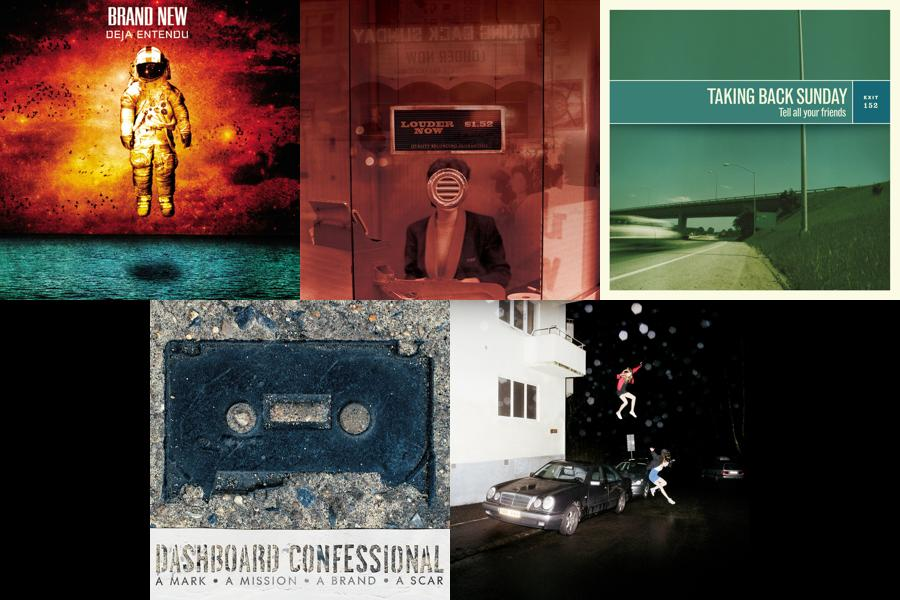

# Yoga

I got my 200 hour Yoga teaching certification in 2021 from [Soul Tribes Yoga](https://soultribeshtx.com) in Houston, TX. I taught mid and advanced level Flow classes at that studio for a year before relocating to Portland, Oregon and eventually New York City.

I taught regular all-level weekly classes at multiple breweries for 3 years, including a weekly Sunday class at [Frost Town Brewing](https://www.frosttownbrew.com) that typically had 10 - 30 students.

My "brand" of Yoga is EMO Yoga, which means EMO music and Flow/Power Yoga.
Checkout my [instagram account](https://www.instagram.com/durden20/) for more
about my Yoga classes and where I'm teaching.

## Music

I create unique playlists for each of my classes and post them on Spotify, named after the date of the class. I've done some analysis on all the classes I've taught prior to August 2026 below. This will give you a good idea of what to expect alongside a class with lots of vinyasas, optional arm balances, and nice flow.

You can find the playlists themselves by looking for playlists named `dd/mm/yy` under my public playlists on [my profile here](https://open.spotify.com/user/durden20?si=38e52ec032374d37).

### General Stats
- Playlists Analyzed: 69
- Total Tracks (with duplicates across playlists): 1,228
- Unique Songs: 729

### Top 5 Artists

1. Taking Back Sunday: 176 occurrences
2. Brand New: 120 occurrences
3. Dashboard Confessional: 79 occurrences
4. City and Colour: 43 occurrences
5. Manchester Orchestra: 41 occurrences

### Top 5 Songs

1. "MakeDamnSure" by Taking Back Sunday (15 playlists)
2. "The Quiet Things That No One Ever Knows" by Brand New (14 playlists)
3. "Cute Without The 'E' (Cut From The Team)" by Taking Back Sunday (13 playlists)
4. "I'm Not Okay (I Promise)" by My Chemical Romance (13 playlists)
5. "Sweetness" by Jimmy Eat World (12 playlists)

### Top 5 Albums

1. Deja Entendu (Brand New): 68 tracks
2. Louder Now (Deluxe Edition) (Taking Back Sunday): 34 tracks
3. Tell All Your Friends (Remastered) (Taking Back Sunday): 29 tracks
4. A Mark, a Mission, a Brand, a Scar (Dashboard Confessional): 24 tracks
5. Science Fiction (Brand New): 23 tracks

## "They can't see you crying if you're sweating."
